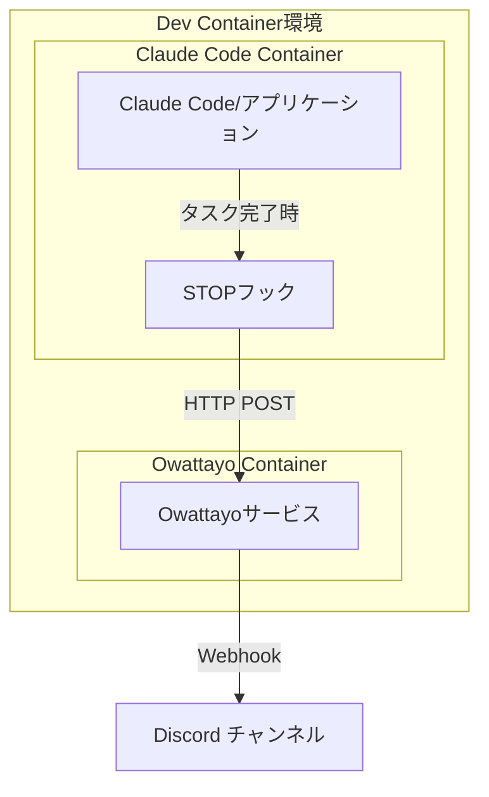

# Claude Code in Dev Container example

> [!NOTE]
> 「[Claude Codeをなるべく安全に動かすためのDev Containerを構築した](https://zenn.dev/backpaper0/articles/038838c4cec2a8)」からこのリポジトリを訪れた方へ。
> 記事を書いてからも開発を進めているため、本リポジトリの内容は記事の内容と乖離していると思います。
> 記事執筆時点の本リポジトリがどのような状態だったか見たい場合は[`zenn/2025-08-19`タグ](https://github.com/backpaper0/claude-code-in-devcontainer-example/tree/zenn/2025-08-19)をご覧ください。

## 概要

このプロジェクトは、Claude CodeをDev Container環境で動作させるための構成例を提供します。

firewallの設定方法は、Claude CodeのDev Container参照実装である https://github.com/anthropics/claude-code/ をベースにしています。

## 構成要素

- **Dev Container**: VS Code Dev Container環境でClaude Codeを実行
- **Firewall**: セキュリティ強化のためのネットワーク制限機能
- **Docker Compose**: 複数サービスのオーケストレーション

## ディレクトリ構造

```
.devcontainer/
├── devcontainer.json              # デフォルトDev Container設定ファイル
├── compose.yaml                   # デフォルトDocker Compose設定
├── claude-code/
│   └── Dockerfile                 # Claude Code用Dockerイメージ
├── firewall/
│   ├── devcontainer-feature.json  # Firewall機能の設定
│   ├── install.sh                 # Firewall環境セットアップ
│   └── init-firewall.sh           # Firewall初期化スクリプト
├── without-owattayo/
│   └── devcontainer.json          # Owattayo分離版Dev Container設定
└── workspace-owner/
    ├── devcontainer-feature.json  # ワークスペース所有者設定機能
    ├── install.sh                 # 所有者設定スクリプトセットアップ
    └── update-workspace-owner.sh  # 所有者設定スクリプト
```

## 機能

### 1. Claude Code統合

- `ghcr.io/anthropics/devcontainer-features/claude-code:1.0`フィーチャーを使用
- Python 3.12環境にClaude Codeをインストール
- uv、pre-commitツールを含む開発環境

### 2. Firewallセキュリティ

- iptablesとipsetを使用した包括的なネットワーク制限
- 動的IP範囲とドメイン解決による許可リスト管理
- 許可されたサービスとドメイン:
  - **GitHub**: API経由で動的IP範囲を取得 (web, api, git)
  - **VS Code**: 更新、マーケットプレイス、同期サービス
  - **開発ツール**: npm registry, PyPI, Maven Central
  - **AI・分析**: Anthropic API, Sentry, Statsig
- セキュリティ検証機能:
  - 制限サイト（example.com）へのアクセス拒否確認
  - 許可サイト（GitHub API）へのアクセス成功確認
- Docker内部DNS解決とlocalhostの保持
- SSH接続とDNS解決の許可

### 3. 開発環境設定

- Python用VS Code拡張機能
- Ruff（フォーマッター・リンター）
- YAML拡張機能
- Python仮想環境の自動設定

### 4. 通知システム（Owattayo）

- HTTPリクエストを受信してDiscordに転送する通知サービス
- Claude Codeのタスク完了時などの作業通知に使用
- `ghcr.io/backpaper0/owattayo:v7`コンテナイメージを使用
- Discord Webhook URLによる通知設定

### 5. ワークスペース所有者管理

- コンテナ内でのファイル権限とワークスペース所有者を適切に設定
- vscodeユーザーとしてワークスペースの所有権を管理
- 開発時のファイル操作を円滑にするための権限設定

## 通知アーキテクチャ

### Owattayoサービス

Owattayoは作業完了通知を目的とした軽量な通知転送サービスです。

**動作フロー:**



**特徴:**

- HTTPリクエストの内容をDiscordに転送
- 作業完了やタスク終了の通知に特化
- Docker Composeによる他サービスとの連携
- 環境変数による設定（`DISCORD_WEBHOOK_URL`）

**設定方法:**

1. Discord ServerでWebhook URLを取得
2. 環境変数`DISCORD_WEBHOOK_URL`に設定
3. Docker Composeでowattayoサービスが自動起動

## 構築手順

### 前提条件

- Docker Desktop または Docker Engine
- VS Code with Dev Containers extension
- Git

### 手順

1. **リポジトリのクローン**

   ```bash
   git clone <repository-url>
   cd <project-directory>
   ```

2. **Dev Container設定の選択**
   
   このプロジェクトでは2つのDev Container設定を提供しています：
   - **default**: 基本的なClaude Code環境（Docker ComposeでOwattayoサービスを含む）
   - **without-owattayo**: Owattayo分離版（Owattayoサービスは別途立てる。複数のDev Containerからの通知要求を集約する目的）

3. **Dev Containerの起動**
   - VS Codeでプロジェクトを開く
   - コマンドパレット（Ctrl+Shift+P / Cmd+Shift+P）を開く
   - "Dev Containers: Reopen in Container"を実行
   - 設定を選択するプロンプトが表示された場合、使用したい設定を選択

4. **自動セットアップ**
   - Dockerイメージのビルドが自動で開始されます
   - Python環境、Claude Code、開発ツールがインストールされます
   - Firewallが自動で設定されます（`postCreateCommand`により実行）

5. **動作確認**

   ```bash
   # Claude Codeの動作確認
   claude --version

   # Firewallの動作確認（制限されたサイトへのアクセステスト）
   curl --connect-timeout 5 https://example.com  # タイムアウトするはず

   # 許可されたサイトへのアクセステスト
   curl --connect-timeout 5 https://api.github.com/zen  # 成功するはず
   ```

### 環境変数

必要に応じて以下の環境変数を設定してください：

- `DISCORD_WEBHOOK_URL`: Discord通知用（ホスト側で設定するとOwattayoサービスのコンテナへも自動で設定されます）

## カスタマイズ

### Firewallの許可ドメイン追加

`init-firewall.sh`の67-90行目のドメインリストに新しいドメインを追加:

**注意**: スクリプトはDNS解決によりドメインのIPアドレスを動的に取得し、ipsetに追加します。GitHubのIP範囲は専用のAPI（`https://api.github.com/meta`）から自動取得されます。

## Claude Code設定

### フック設定（.claude/settings.json）

Claude Codeは作業完了時にOwattayoサービス経由で通知を送信するためのSTOPフックを設定しています。

**設定(Owattayoがユーザープロンプトを解決):**
```bash
jq -c --arg notifier $OWATTAYO_NOTIFIER '. + {notifier:$notifier}' | curl -X POST http://owattayo:8000/notify -H "Content-Type: application/json" -d @-
```
- StopイベントをそのままOwattayoへ送信する
- Owattayo側ではDev Containerのボリュームをマウントしており、Stopイベントに含まれる`transcript_path`が示すファイルを直接読み込み、ユーザープロンプトを解決する
- Owattayoがユーザープロンプトを添えて完了通知を行う

**設定（Stopフックがユーザープロンプトを解決）:**
```bash
jq -r '.transcript_path' | xargs -I{} cat {} | jq -c 'select(.type == "user" and (has("toolUseResult") | not)) | {prompt:.message.content}' | tail -n 1 | jq -c --arg notifier $OWATTAYO_NOTIFIER '. + {notifier:$notifier}' | curl --connect-timeout 5 -X POST http://owattayo:8000/notify -H 'Content-Type: application/json' -d @-
```
- Stopフック内でStopイベントに含まれる`transcript_path`が示すファイルを直接読み込み、ユーザープロンプトを解決する
- ユーザープロンプトをOwattayoへ送信する
- Owattayoがユーザープロンプトを添えて完了通知を行う
- 接続タイムアウト（5秒）を設定してより安定した動作を実現

### VS Code拡張機能の追加

`devcontainer.json`の`customizations.vscode.extensions`配列に追加:
