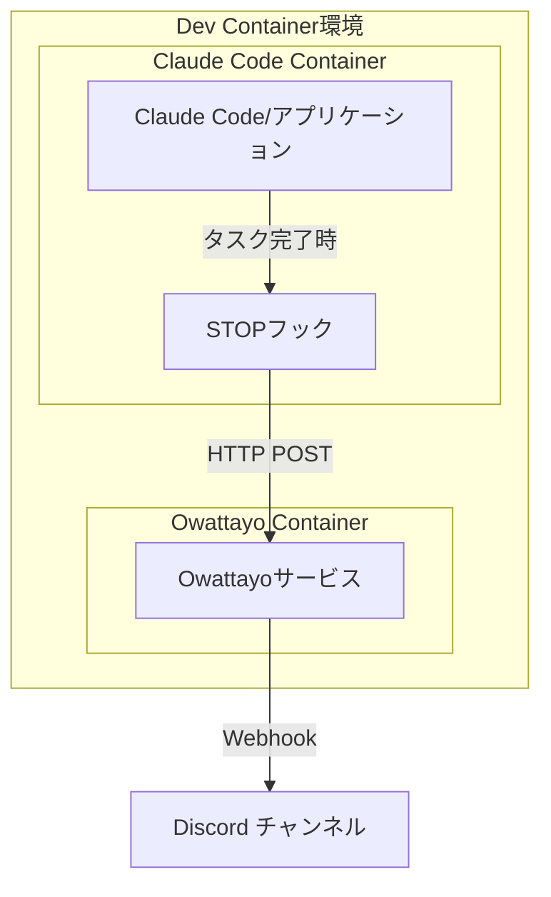

# Claude Code in Dev Container example

## 概要

このプロジェクトは、Claude CodeをDev Container環境で動作させるための構成例を提供します。

firewallの設定方法は、Claude CodeのDev Container参照実装である https://github.com/anthropics/claude-code/ をベースにしています。

> [!NOTE]
> **既知の課題**
> 
> Rancher Desktopなどを使用しておりホストがWindowsの場合、Windowsホスト側にあるディレクトリをマウントしたらコンテナ側では所有者が必ず`root`ユーザーになってしまいます。
> 追って対応は行いますが、ひとまず手動で所有者を`vscode`ユーザーへ変更することでこの課題を回避できます。
> 
> 手動で回避する場合、少し工夫が必要です。`vscode`ユーザーは`chown`できないため、`docker exec -u root`で`root`ユーザーとして操作を行います。
> 
> ```
> docker exec -u root <対象のコンテナ> chown -R vscode:vscode /workspace
> ```

## 構成要素

- **Dev Container**: VS Code Dev Container環境でClaude Codeを実行
- **Firewall**: セキュリティ強化のためのネットワーク制限機能
- **Docker Compose**: 複数サービスのオーケストレーション

## ディレクトリ構造

```
.devcontainer/
├── devcontainer.json          # Dev Container設定ファイル
├── compose.yaml              # Docker Compose設定
├── claude-code/
│   └── Dockerfile           # Claude Code用Dockerイメージ
└── firewall/
    ├── devcontainer-feature.json  # Firewall機能の設定
    ├── install.sh                # Firewall環境セットアップ
    └── init-firewall.sh          # Firewall初期化スクリプト
```

## 機能

### 1. Claude Code統合

- `ghcr.io/anthropics/devcontainer-features/claude-code:1.0`フィーチャーを使用
- Python 3.12環境にClaude Codeをインストール
- uv、pre-commitツールを含む開発環境

### 2. Firewallセキュリティ

- iptablesとipsetを使用した包括的なネットワーク制限
- 動的IP範囲とドメイン解決による許可リスト管理
- 許可されたサービスとドメイン:
  - **GitHub**: API経由で動的IP範囲を取得 (web, api, git)
  - **VS Code**: 更新、マーケットプレイス、同期サービス
  - **開発ツール**: npm registry, PyPI, Maven Central
  - **AI・分析**: Anthropic API, Sentry, Statsig
- セキュリティ検証機能:
  - 制限サイト（example.com）へのアクセス拒否確認
  - 許可サイト（GitHub API）へのアクセス成功確認
- Docker内部DNS解決とlocalhostの保持
- SSH接続とDNS解決の許可

### 3. 開発環境設定

- Python用VS Code拡張機能
- Ruff（フォーマッター・リンター）
- YAML拡張機能
- Python仮想環境の自動設定

### 4. 通知システム（Owattayo）

- HTTPリクエストを受信してDiscordに転送する通知サービス
- Claude Codeのタスク完了時などの作業通知に使用
- `ghcr.io/backpaper0/owattayo:v1`コンテナイメージを使用
- Discord Webhook URLによる通知設定

## 通知アーキテクチャ

### Owattayoサービス

Owattayoは作業完了通知を目的とした軽量な通知転送サービスです。

**動作フロー:**



**特徴:**

- HTTPリクエストの内容をDiscordに転送
- 作業完了やタスク終了の通知に特化
- Docker Composeによる他サービスとの連携
- 環境変数による設定（`DISCORD_WEBHOOK_URL`）

**設定方法:**

1. Discord ServerでWebhook URLを取得
2. 環境変数`DISCORD_WEBHOOK_URL`に設定
3. Docker Composeでowattayoサービスが自動起動

## 構築手順

### 前提条件

- Docker Desktop または Docker Engine
- VS Code with Dev Containers extension
- Git

### 手順

1. **リポジトリのクローン**

   ```bash
   git clone <repository-url>
   cd <project-directory>
   ```

2. **Dev Containerの起動**
   - VS Codeでプロジェクトを開く
   - コマンドパレット（Ctrl+Shift+P / Cmd+Shift+P）を開く
   - "Dev Containers: Reopen in Container"を実行

3. **自動セットアップ**
   - Dockerイメージのビルドが自動で開始されます
   - Python環境、Claude Code、開発ツールがインストールされます
   - Firewallが自動で設定されます（`postCreateCommand`により実行）

4. **動作確認**

   ```bash
   # Claude Codeの動作確認
   claude --version

   # Firewallの動作確認（制限されたサイトへのアクセステスト）
   curl --connect-timeout 5 https://example.com  # タイムアウトするはず

   # 許可されたサイトへのアクセステスト
   curl --connect-timeout 5 https://api.github.com/zen  # 成功するはず
   ```

### 環境変数

必要に応じて以下の環境変数を設定してください：

- `DISCORD_WEBHOOK_URL`: Discord通知用（ホスト側で設定するとOwattayoサービスのコンテナへも自動で設定されます）

## カスタマイズ

### Firewallの許可ドメイン追加

`init-firewall.sh`の67-90行目のドメインリストに新しいドメインを追加:

**注意**: スクリプトはDNS解決によりドメインのIPアドレスを動的に取得し、ipsetに追加します。GitHubのIP範囲は専用のAPI（`https://api.github.com/meta`）から自動取得されます。

### VS Code拡張機能の追加

`devcontainer.json`の`customizations.vscode.extensions`配列に追加:
